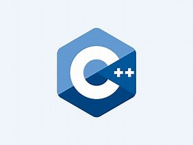
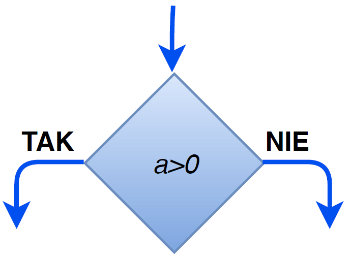
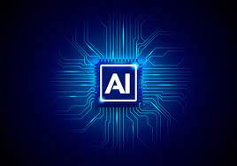

Informatyka i komputery
========================

Tworzenie dokumentow na komputerze
W tym pliku bede tworzyl dokument tekstowy w Sphinx

Tworzenie dokumentu
---------------------

W tym edytorze chce stworzyć tresci zwiazane z informatyką i nie tylko,  gdyż są to interesujące informacje
Komputery pozwalaja na wiele dzialan matematycznych,w celach edukacyjnych czy też firmowych.  
Dzieki niemu możemy sobie ułatwić naszą codzienną pracę.

Komputer

Czym jest informatyka?
-----------------------------

Informatyka to dziedzina nauki, ktora dotyczy wszyelkich informacji związanych z komputerami i oprogramowaniem.
Kładzie ona nacisk na to, co się robi z informacją (zbiera, przechowuje, przetwarza i 
udostępnia) oraz przy pomocy czego się to realizuje. Jest także rozumiana jako nośnik ludzkiej wiedzy i komunikacji w dziedzinach 
technicznych, ekonomicznych i socjalnych.

Działy informatyki 

Programowanie - związane jest z tworzeniu kodu w linijkach za pomocą języków programowania.

Spośród języków programowania możemy wyróżnić C++ i Python.
Progamowawać można na różne sposoby, gdyż jest to bardzo szeroki dział informatyki, pozwalający tworzy mniej lub bardziej skopmplikowane projekty

Jeden z języków programowania

Język C++  to jeden z najpopularniejszych języków programowania, szczególnie w branży IT. Został opracowany w 1979 roku przez Bjarne Stroustrupa.
Uważany jest za język o wysokim poziomie abstrakcji, co oznacza, że jest on bardzo blisko struktury danych i procesów zachodzących w komputerze.
charakteryzuje się  dużą elastycznością i możliwością dostosowania do indywidualnych potrzeb programisty. Jest to możliwe dzięki zastosowaniu mechanizmów takich jak klasy i obiekty oraz funkcje i procedury.
To język wieloparadygmatowy. Oznacza to, że można w nim stosować jednocześnie różne style programowania, w tym programowanie proceduralne, obiektowe, generyczne.

Algorytmika jest częścią informatyki zajmującą się badaniem algorytmów. Programiści na wszystkich stopniach zaawansowania korzystają z algorytmów, projektując sposób działania i funkcjonalności programów czy systemów.
Algorytmy to skończony ciąg jasno zdefiniowanych czynności koniecznych do wykonania określonego rodzaju zadań, przepis na rozwiązanie problemu, instrukcja na wykonanie czynności. Mówi nam, jakie kroki trzeba wykonać po kolei, żeby otrzymać oczekiwany efekt.

Przykładowy algorytm

Teoretyczna Informatyka:
Teoria obliczeń: Zajmuje się fundamentalnymi aspektami obliczeń, w tym modelami obliczeniowymi jak automaty i maszyny Turinga.

Maszyna Turinga
Źródło:www.timetoast.com
Teoria algorytmów i złożoności: Analizuje efektywność i złożoność algorytmów.

Teoria informacji: Zajmuje się zagadnieniami związanymi z przesyłaniem, kodowaniem, i przetwarzaniem informacji.

Informatyka Praktyczna:

Bazy danych: Skupia się na projektowaniu, implementacji i zarządzaniu bazami danych.

Sztuczna inteligencja: Zajmuje się tworzeniem systemów zdolnych do wykonywania zadań wymagających inteligencji ludzkiej.

Machine Learning i Data Science: Skupiają się na analizie danych i tworzeniu modeli do automatycznego uczenia się.

Sztuczna inteligencja AI

Interdyscyplinarne Obszary:

Bioinformatyka: Łączy informatykę z biologią, szczególnie w analizie danych biologicznych.

Informatyka medyczna: Skupia się na wykorzystaniu technologii informatycznych w medycynie i opiece zdrowotnej.

Robotyka: Łączy informatykę, inżynierię i czasami biologię, by tworzyć i programować roboty.

