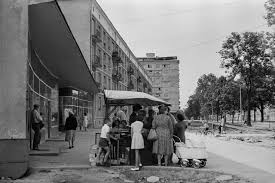
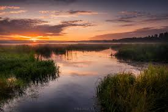
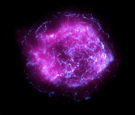

Do czego służą zdjęcia?
=========================

Zdjecia

Zdjecia pozwalają nam przechowywać wizualnę treści dotyczące różnych wydarzeń czy wspomnień życiowych.
Są bardzo przydatne do dokumentacji i przekazywaniu infomacji innym osobom.
Przykłady zdjęc 

Zdjęcia osobiste- to zdjęcia prywatne, najczęściej przechowywane we własnym domu.
Dostęp do niech mają ich właściciele , nie są nikomu udostępniane. 	

Zdjęcia historyczne- zdjęcia przedstawiające pewne wydarzenia historyczne. 
Możemy je znaleźć w książkach czy internecie.
Są one objęte prawem autorskim, lecz większośc ludzi ma do nich dostęp.

Przykład zdjęcia historycznego

Źródło:tychy.info

Krajobraz 

Kolejny przykład zdjęć to fotografie artystyczne - mają celu wyrażenie emocji twórcy, jego pomysłu i przesłania. Są swego rodzaju medium, za pomocą którego artysta komunikuje się z odbiorcami, chcąc im coś przekazać.

Krajobraz 

Zdjęcia naukowe dotyczą szczególnych eksperymentów naukowych i ułatwiają badania. Takie zdjęcia pozwalają na interpretowanie rzeczy dokładniej i czytelniej.

Zdjęcie naukowe

Fotografie archiwizacyjne - służą do przechowywania w archiwach, to zdjęcia mające szczególne znaczenie dla historii, które są poddawane procesowi archiwizacji,
dzięki czemu będzie je można zobaczyć po wielu latach.

Fotografia reklamowa - zdjęcia mające na celu promować produkty, usługi lub marki.

Dalsze zastosowania zdjęć

Zdjęcia mogą służyć także  jako dowody w sprawach sądowych, pomagając w dochodzeniu prawdy.

Architektura i projektowanie wnętrz: Zdjęcia są wykorzystywane do prezentacji i dokumentacji projektów architektonicznych i wnętrzarskich.

Dziennikarstwo i media: Fotografia jest kluczowym elementem w przekazywaniu wiadomości i informacji. Zdjęcia w gazetach, magazynach i w Internecie pomagają ilustrować i opowiadać historie.

